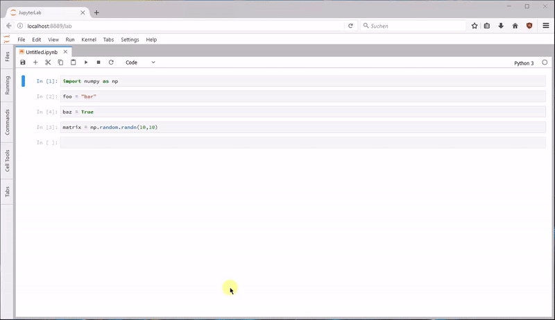

# jupyterlab_variableinspector

Jupyterlab extension that shows currently used variables and their values. The goal is to provide a tool similar to the variable inspector in RStudio.

This project is inspired by the [variable inspector extension for jupyter notebooks](https://github.com/ipython-contrib/jupyter_contrib_nbextensions/tree/master/src/jupyter_contrib_nbextensions/nbextensions/varInspector) and by the [inspector extension included in jupyterlab](https://github.com/jupyterlab/jupyterlab/tree/master/packages/inspector-extension).

For the time being, this project is still in its first steps. Contributions in any form are very welcome!

## Features



- Allows inspection of variables for both python consoles and python notebooks
- Allows inspection of matrices in a datagrid-viewer. This might not work for large matrices.

## Prerequisites

- JupyterLab [1.0]

### Requirements for Python functionality

- `pandas` and `numpy` are required to enable matrix inspection.
- `pyspark` for spark support.
- `tensorflow` and `keras` to allow inspection of tf objects.

### Requirements for R functionality

- The `repr` library.

## Installation

First of all, you need an installation of a current version of JupyterLab. Please refer to the [installation guide](https://github.com/jupyterlab/jupyterlab#installation).

You can install the inspector either by running
`jupyter labextension install @lckr/jupyterlab_variableinspector`

or by cloning the repository and build it locally following these steps:

1. Clone this repository with `git clone https://github.com/lckr/jupyterlab-variableInspector`

2. Once you downloaded the repository use the following steps:

```
cd jupyterlab-variableInspector
npm install
npm run build
jupyter labextension install .
```

3. Confirm the installation of the extension with:

```
jupyter labextension list
```
which should print `enabled` and `OK`.
